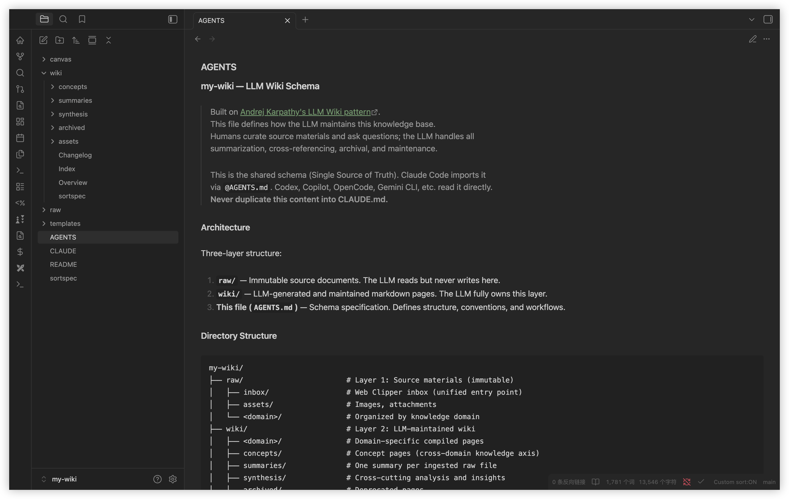

English | [简体中文](./README.zh-CN.md)

# llm-wiki-builder

One command to initialize an embedded [Andrej Karpathy's LLM Wiki](https://gist.github.com/karpathy/442a6bf555914893e9891c11519de94f) for the current project.

The current project directory is the source material. AI-generated summaries, concepts, and synthesis pages are written directly to `llm-wiki/`.

Auto-detects Claude Code / Codex / Gemini, installs missing base tools, and configures Obsidian + recommended plugins (Skills & Plugins & Shortcuts), so AI can continuously build and maintain your project knowledge system.

Compatible with Claude Code, Codex, Copilot, Gemini CLI, OpenCode, and other mainstream AI agents out of the box.



## Installation

### Option A — bash script

```bash
curl -fsSL https://raw.githubusercontent.com/lcpdeb/llm-wiki-builder/main/install.sh | bash
```
> **Windows users**: Run the installer from **Git Bash** (recommended) or **WSL2** — `cmd.exe` and PowerShell cannot execute bash scripts. Install [Git for Windows](https://git-scm.com/download/win) (provides Git Bash + curl), then run `git config --global core.autocrlf input` to avoid `bad interpreter` errors. The installer auto-detects winget / Chocolatey / Scoop to fetch Obsidian, Node.js and Git.
>
> Path detection output is persisted once to `llm-wiki/detected-paths.json` (project-level config). The installer does not export these paths as environment variables.

With options:

```bash
# Only detect and install global tools (AI agent, Obsidian, NodeJS, Agent Skills, etc.)
curl -fsSL https://raw.githubusercontent.com/lcpdeb/llm-wiki-builder/main/install.sh | bash -s -- --only-tools

# Skip global tools detection/installation, only initialize llm-wiki in the current project
curl -fsSL https://raw.githubusercontent.com/lcpdeb/llm-wiki-builder/main/install.sh | bash -s -- --only-wiki

# Skip tools and llm-wiki initialization, only configure Obsidian (plugins, shortcuts) in current project
curl -fsSL https://raw.githubusercontent.com/lcpdeb/llm-wiki-builder/main/install.sh | bash -s -- --only-obsidian
```

### Option B — Skill install (for AI Agent users, or when bash has environment issues)

> This produces the same result as `install.sh`. Agent-guided creation consumes tokens — recommended only when the bash script can't run in your environment.

1. Install the Skill

    ```bash
    npx skills add lcpdeb/llm-wiki-builder -g
    ```

2. Trigger by chatting in your AI Agent:

    ```bash
    "create llm wiki"

    # or

    "scaffold an llm wiki"

    # or similar...
    ```

    The Agent will auto-detect installed tools and guide you through the setup.

3. Or, use the slash command in your Agent:

    ```bash
    /llm-wiki-builder
    ```

    The slash command supports all parameters, e.g.:

    ```bash
    # Only initialize llm-wiki and AGENTS.md, skip tool install
    /llm-wiki-builder --only-wiki

    # /llm-wiki-builder --bash    # Pipe through bash script — saves tokens
    ```

### Options

Supported options (use as needed):

| Option | Description | Default |
|--------|-------------|---------|
| `--name <name>` | Wiki display name | Project directory name |
| `--dir <directory>` | Project directory | Current directory |
| `--lang <en\|zh>` | Wiki language | `en` |
| `--only-tools` | Install tools only, without creating wiki | - |
| `--only-wiki` | Initialize `llm-wiki` and `AGENTS.md` in the project, without installing tools | - |
| `--only-obsidian` | Configure Obsidian in the project root only | - |
| `--bash` | Used via `/llm-wiki-builder --bash` (gives Agent users a more flexible, token-saving path) | - |

### What Gets Installed

Detects what's already on your system and only installs what's missing.

**Tools & Skills**

- ✅ **AI Agent** — Claude Code, Codex, or Gemini; Claude Code has the highest default priority when multiple are installed
- ✅ **Node.js** — Runtime for Skills CLI and npm-installed agent CLIs
- ✅ **Obsidian** — Wiki editor and visual graph viewer
- ✅ **[kepano/obsidian-skills](https://github.com/kepano/obsidian-skills)** — Obsidian Markdown, CLI interaction, Bases database views, web scraping (defuddle)
- ✅ **[axtonliu/visual-skills](https://github.com/axtonliu/axton-obsidian-visual-skills)** — Excalidraw diagrams, Mermaid charts, Obsidian Canvas, JSON Canvas
- ✅ **Git** — Version control (optional)

> Skills are installed globally via [Skills CLI](https://github.com/vercel-labs/skills), shared across agents.

**Obsidian**

- **Plugins** (16 plugins: 9 Core + 7 UX, auto-configured with wiki)

    Core plugins (required for llm-wiki functionality):

    - ✅ **[Claudian](https://github.com/YishenTu/claudian)** — Embed Claude Code / Codex / OpenCode agents in vault, sidebar chat with full agentic capabilities
    - ✅ **Dataview** — SQL-like queries on page frontmatter
    - ✅ **Templater** — Template system for new pages
    - ✅ **Linter** — Automatic Markdown formatting
    - ✅ **Custom Sort** — File explorer ordering via sortspec
    - ✅ **Obsidian Git** — Auto git commit/push (requires Git)
    - ✅ **Tag Wrangler** — Rename, merge, and manage tags
    - ✅ **Strange New Worlds** — Show wikilink reference counts
    - ✅ **Homepage** — Set a landing page on vault open

    UX plugins (enhance Obsidian editing experience):

    - ✅ **Omnisearch** — Fuzzy search across vault
    - ✅ **Switcher++** — Quick switcher with headings navigation
    - ✅ **Hider** — Hide UI elements for cleaner interface
    - ✅ **Editing Toolbar** — MS Word-like toolbar + F11 fullscreen shortcuts
    - ✅ **Excalidraw** — Hand-drawn style diagrams
    - ✅ **Quiet Outline** — Enhanced outline view
    - ✅ **Open in Terminal** — Open vault in terminal

- **Key Shortcuts**

    - `Cmd+Shift+F` → Omnisearch (fuzzy search)
    - `Cmd+R` → Quick switcher (headings)
    - `Cmd+F11` → Workplace fullscreen
    - `Cmd+Shift+F11` → Editor fullscreen focus

**Browser Extension (recommended)**

- **[Obsidian Web Clipper](https://chromewebstore.google.com/detail/obsidian-web-clipper/cnjifjpddelmedmihgijeibhnjfabmlf)** — Clip web articles into the project and ask the agent to summarize them into `llm-wiki/`

## Getting Started

```bash
# Open in Obsidian
open -a Obsidian .

# Start AI agent (also works with codex / copilot / gemini, etc.)
claude
```

Then chat with the AI:

- **Analyze** → `Analyze this repository and update llm-wiki`
- **Query** → `What is the relationship between X and Y?`
- **Lint** → `Run a health check on llm-wiki`

## Wiki Structure

```
project/
├── llm-wiki/               # LLM-maintained analysis output
│   ├── concepts/            # Concept definition pages
│   ├── summaries/           # Source material summaries
│   ├── synthesis/           # Cross-cutting analysis
│   ├── archived/            # Deprecated pages
│   ├── assets/excalidraw/   # Diagrams
│   ├── canvas/              # JSON Canvas visual maps
│   └── templates/           # Page templates
├── .obsidian/               # Obsidian config and plugins for the project
├── AGENTS.md                # Project agent rules with llm-wiki managed block
└── <project source files>   # Source material analyzed by the agent
```

> **Tip**: The project root is the source layer. The agent writes only to `llm-wiki/` unless you explicitly ask it to modify project files.

## What is LLM Wiki?

[LLM Wiki](https://gist.github.com/karpathy/442a6bf555914893e9891c11519de94f) is a knowledge management pattern proposed by Andrej Karpathy: instead of traditional RAG that retrieves from scratch every query, the LLM **incrementally builds and maintains a persistent wiki** — cross-references are established automatically, contradictions are flagged, and synthesis is continuously updated. Each new source makes the wiki richer.

**Suitable for**: personal knowledge management, technical research, domain learning notes, team knowledge bases — any scenario where you want AI to help you accumulate and organize knowledge over time.

**How it works**: Claude Code, Codex, or Gemini can serve as the AI agent that reads, writes and maintains the wiki; Claude Code is the default priority agent, but not the only supported option. [Obsidian](https://obsidian.md) serves as the visual editor and reader. You chat with the AI to ingest sources, query knowledge, and run health checks — while browsing and navigating the wiki graph in Obsidian.

**Three-layer architecture**: project root (source material) → `llm-wiki/` (LLM-maintained pages) → Schema (`AGENTS.md`)

**Three operations**: **Analyze** (build/update knowledge) → **Query** (ask questions) → **Lint** (health check)

## Refactor Notes

This project keeps the upstream LLM Wiki idea, while refactoring the installer and workflow for project-embedded usage.

- Workflow model changed from a separate `repo-wiki` + `raw/wiki` process to an embedded `<project>/llm-wiki` process.
- The current project root is now the default source layer; users no longer need to copy materials into `raw/`.
- Output boundaries were tightened: generated summaries, concepts, synthesis, and logs are written directly under `llm-wiki/`.
- Re-runs are designed to be idempotent: missing scaffold files are backfilled without deleting existing analysis pages.
- `AGENTS.md` now uses a managed block to support append/update behavior and avoid duplicate rule injection on repeated runs.
- Runtime path detection persists once to `llm-wiki/detected-paths.json` as local project config and is ignored via project-root `.gitignore`.
- Obsidian setup was adjusted to project-root `.obsidian` configuration and missing-plugin installation only.
- Theme and base-color mutation behavior was removed (`appearance.json`, `cssTheme`, `accentColor`, Minimal theme settings) to avoid overriding user preferences.

Purpose:
- reduce setup friction,
- keep analysis close to the real source tree,
- make repeated execution safer,
- and limit installer side effects to predictable, project-scoped configuration.

## Credits

- [Andrej Karpathy — LLM Wiki](https://gist.github.com/karpathy/442a6bf555914893e9891c11519de94f)
- This project is based on and adapted from [eleven-net-cn/llm-wiki-starter](https://github.com/eleven-net-cn/llm-wiki-starter), with additional refactoring and platform-path detection changes.

## License

[MIT](LICENSE)

