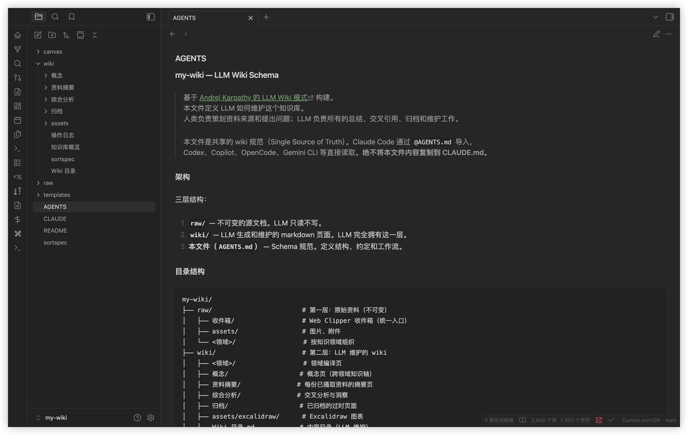

[English](./README.md) | 简体中文

# llm-wiki-builder

一条命令为当前项目初始化内嵌的 [Andrej Karpathy 的 LLM Wiki](https://gist.github.com/karpathy/442a6bf555914893e9891c11519de94f) AI 知识库。

当前项目目录本身就是源材料；AI 生成的摘要、概念页和综合分析会直接写入 `llm-wiki/`。

自动检测 Claude Code / Codex / Gemini / OpenCode，安装缺失的基础工具，并配置 Obsidian + 推荐的插件（Skills & Plugins & 快捷键）等，让 AI 帮你持续积累和维护项目知识体系。

自动兼容 Claude Code、Codex、Copilot、Gemini CLI、OpenCode 等主流 AI Agent 使用。



## 安装

### 方式 A — bash 脚本

```bash
curl -fsSL https://raw.githubusercontent.com/lcpdeb/llm-wiki-builder/main/install.sh | bash
```
> **Windows 用户**：安装脚本是 bash 脚本，请在 **Git Bash**（推荐）或 **WSL2** 中执行 —— `cmd.exe` 与 PowerShell 无法运行 bash。先安装 [Git for Windows](https://git-scm.com/download/win)（自带 Git Bash + curl），再执行 `git config --global core.autocrlf input` 避免 `bad interpreter` 错误。脚本会自动检测 winget / Chocolatey / Scoop 来安装 Obsidian、Node.js、Git。
>
> 路径检测结果会首次写入 `llm-wiki/detected-paths.json`（项目级配置），不会导出为环境变量。

参数示例：

```bash
# 仅检测、安装全局工具套件（AI Agent、Obsidian、NodeJS、Agent Skills 等）
curl -fsSL https://raw.githubusercontent.com/lcpdeb/llm-wiki-builder/main/install.sh | bash -s -- --only-tools

# 跳过全局工具套件的检测、安装，仅在当前项目初始化 llm-wiki
curl -fsSL https://raw.githubusercontent.com/lcpdeb/llm-wiki-builder/main/install.sh | bash -s -- --only-wiki

# 跳过全局工具套件检测和 llm-wiki 初始化，仅在当前项目配置 Obsidian 插件、快捷键等配置
curl -fsSL https://raw.githubusercontent.com/lcpdeb/llm-wiki-builder/main/install.sh | bash -s -- --only-obsidian

# 初始化 llm-wiki，并把 Graphify 作为可选项目地图层接入
curl -fsSL https://raw.githubusercontent.com/lcpdeb/llm-wiki-builder/main/install.sh | bash -s -- --with-graphify
```

### 方式 B — Skill 安装（面向 AI Agent 用户，或有系统、环境兼容问题时）

> 实际上这与 install.sh bash 脚本创建效果完全相同，Agent 创建会消耗 Token，推荐仅在无法正常运行 bash 脚本安装时使用。

1. 安装 Skill

    ```bash
    npx skills add lcpdeb/llm-wiki-builder -g
    ```

2. 在 Agent 中对话：

    ```bash
    “创建 llm-wiki 知识库”

    # 或

    “创建 wiki 知识库”

    # 或其它...
    ```

    Agent 会自动检测已装工具，并引导完成搭建。

3. 或者，Agent 中使用命令创建

    ```bash
    /llm-wiki-builder
    ```

    Agent Command 命令也支持所有参数，示例：

    ```bash
    # 仅初始化 llm-wiki 和 AGENTS.md，不安装工具
    /llm-wiki-builder --only-wiki

    # /llm-wiki-builder --bash    # 走 bash 脚本创建，更节省 Token
    ```

### 参数

支持的参数，按需选用：

| 参数 | 说明 | 默认值 |
|------|------|--------|
| `--name <name>` | Wiki 显示名称 | 项目目录名 |
| `--dir <directory>` | 项目目录 | 当前目录 |
| `--lang <en\|zh>` | Wiki 语言 | `en` |
| `--only-tools` | 仅安装工具套件，不创建 wiki 知识库 | - |
| `--only-wiki` | 仅在项目中初始化 `llm-wiki` 和 `AGENTS.md`，不安装工具 | - |
| `--only-obsidian` | 仅在项目根目录配置 Obsidian | - |
| `--with-graphify` | 安装/注册 Graphify，生成 `.graphifyignore`，并让 Agent 把 `graphify-out/` 作为项目地图层使用 | - |
| `--yes` / `-y` | 非交互模式，使用默认值，并避免修改全局配置的交互提示 | - |
| `--bash` | 通过 `/llm-wiki-builder --bash` 命令使用（提供更灵活的 Agent 使用方式） | - |

### 检测安装

自动检测系统已有工具，只安装缺少的部分。

**工具 & Skills**

- ✅ **AI Agent** — 支持 Claude Code、Codex、Gemini、OpenCode；检测到多个时默认优先 Claude Code
- ✅ **Node.js** — Skills CLI 和 npm 安装的 Agent CLI 运行时
- ✅ **Obsidian** — Wiki 编辑器和可视化图谱查看器
- ✅ **[kepano/obsidian-skills](https://github.com/kepano/obsidian-skills)** — Obsidian Markdown、CLI 交互、Bases 数据库视图、网页清洗（defuddle）
- ✅ **[axtonliu/visual-skills](https://github.com/axtonliu/axton-obsidian-visual-skills)** — Excalidraw 图表、Mermaid 可视化、Obsidian Canvas、JSON Canvas
- ✅ **Git** — 版本控制（可选）

> Skills 通过 [Skills CLI](https://github.com/vercel-labs/skills) 全局安装，跨 Agent 共享。

**Obsidian**

- **插件**（16 个插件：9 Core + 7 UX，随 wiki 自动配置）

    Core 插件（llm-wiki 核心功能必需）：

    - ✅ **[Claudian](https://github.com/YishenTu/claudian)** — Vault 内嵌 Claude Code / Codex / OpenCode agent，侧边栏对话直接读写文件
    - ✅ **Dataview** — 基于 frontmatter 的 SQL 风格查询
    - ✅ **Templater** — 页面模板系统
    - ✅ **Linter** — 自动 Markdown 格式化
    - ✅ **Custom Sort** — 通过 sortspec 控制文件浏览器排序
    - ✅ **Obsidian Git** — 自动 git 提交/推送（需 Git）
    - ✅ **Tag Wrangler** — 重命名、合并和管理标签
    - ✅ **Strange New Worlds** — 显示 wikilink 引用计数
    - ✅ **Homepage** — 打开 vault 时设置首页

    UX 插件（增强 Obsidian 编辑体验）：

    - ✅ **Omnisearch** — 全库模糊搜索
    - ✅ **Switcher++** — 快速切换器，支持标题导航
    - ✅ **Hider** — 隐藏 UI 元素，界面更简洁
    - ✅ **Editing Toolbar** — Word 风格编辑工具栏 + F11 全屏快捷键
    - ✅ **Excalidraw** — 手绘风格图表
    - ✅ **Quiet Outline** — 增强大纲视图
    - ✅ **Open in Terminal** — 打开 vault 到终端

- **快捷键**

    - `Cmd+Shift+F` → Omnisearch（模糊搜索）
    - `Cmd+R` → 快速切换器（标题导航）
    - `Cmd+F11` → 工作区全屏
    - `Cmd+Shift+F11` → 编辑器全屏专注

**浏览器扩展（推荐使用，不会自动安装）**

- **[Obsidian Web Clipper](https://chromewebstore.google.com/detail/obsidian-web-clipper/cnjifjpddelmedmihgijeibhnjfabmlf)** — 将网页文章剪藏到项目中，再让 Agent 汇总到 `llm-wiki/`

**Graphify（可选地图层）**

当你希望在长期 wiki 之外增加一层结构化项目地图时，可以使用 `--with-graphify`。Graphify 输出保留在 `graphify-out/`（`GRAPH_REPORT.md`、`graph.json`、`graph.html`），`llm-wiki-builder` 继续把 `llm-wiki/` 作为长期 Markdown 知识库。

- 需要 Python 3.10+；当前 PyPI 包名是 `graphifyy`，CLI 仍是 `graphify`。
- 安装器会按当前选中的 AI Agent 注册 Graphify：Claude Code、Codex、Gemini 或 OpenCode。
- 如果选中 Codex，安装器会先询问，再修改 `~/.codex/config.toml` 中的 `multi_agent = true`，并在修改前备份。
- 安装器会在首次建图前询问，因为处理文档、PDF、图片、音频、视频等可能消耗模型/API额度。
- Graphify 的 `--wiki` 输出不会自动合并进 `llm-wiki/`。

## 开始使用

```bash
# 用 Obsidian 打开
open -a Obsidian .

# 启动 AI Agent（也可使用 codex / copilot / gemini 等）
claude
```

然后与 AI 对话：

- **分析** → `分析这个仓库并更新 llm-wiki`
- **查询** → `X 和 Y 之间有什么关系？`
- **巡检** → `运行一次 llm-wiki 巡检`
- **地图**（启用 `--with-graphify` 时）→ `/graphify .`，Codex 中使用 `$graphify .`

## 知识库结构

```
project/
├── llm-wiki/               # LLM 维护的分析输出
│   ├── 概念/                 # 概念定义页
│   ├── 资料摘要/             # 资料摘要页
│   ├── 综合分析/             # 交叉分析
│   ├── 归档/                 # 已归档页面
│   ├── assets/excalidraw/   # 图表
│   ├── canvas/              # JSON Canvas 可视化地图
│   └── templates/           # 页面模板
├── graphify-out/            # 可选 Graphify 地图输出
├── .obsidian/               # 当前项目的 Obsidian 配置和插件
├── AGENTS.md                # 带 llm-wiki 受管理区块的 Agent 规则
└── <项目源码和文档>           # Agent 读取的源材料
```

> **提示**：项目根目录就是源材料层。除非你明确要求，Agent 只把分析结果写入 `llm-wiki/`。

> **用 Obsidian 打开项目根目录**，不要打开 `llm-wiki/` 子目录。插件、快捷键和 `app.json` 都写在 `<项目>/.obsidian/`，把 `llm-wiki/` 当 vault 打开会看不到任何已配置的插件。

## 什么是 LLM Wiki？

[LLM Wiki](https://gist.github.com/karpathy/442a6bf555914893e9891c11519de94f) 是 Andrej Karpathy 提出的知识管理模式：不同于传统 RAG 每次查询从零检索，LLM **增量式地构建和维护一个持久化的 wiki** —— 交叉引用自动建立，矛盾被标记，综合分析持续更新。每次添加新资料都会让 wiki 更丰富。

**适用场景**：个人知识管理、技术调研、领域学习笔记、团队知识库 —— 任何需要 AI 帮你长期积累和整理知识的场景。

**工作方式**：Claude Code、Codex、Gemini 或 OpenCode 都可以作为 AI Agent 负责读写和维护 wiki；Claude Code 是默认优先 Agent，但不是唯一可用 Agent。[Obsidian](https://obsidian.md) 作为可视化编辑器和阅读器。你通过与 AI 对话来摄取资料、查询知识、运行巡检 —— 同时在 Obsidian 中浏览和导航知识图谱。

**三层架构**：项目根目录（源材料）→ `llm-wiki/`（LLM 维护的页面）→ Schema（`AGENTS.md`）

**三大操作**：**Analyze**（分析/更新知识）→ **Query**（查询）→ **Lint**（巡检）

## 重构说明

本项目延续上游 LLM Wiki 思路，同时围绕“项目内嵌使用”对安装器与工作流做了较大重构。

- 工作流从独立 `repo-wiki` + `raw/wiki` 模式，改为内嵌 `<project>/llm-wiki` 模式。
- 当前项目根目录成为默认源材料层，不再要求手动把资料复制到 `raw/`。
- 输出边界收敛到 `llm-wiki/`：摘要、概念页、综合分析、日志直接写入该目录。
- 重复执行强调幂等：补齐缺失脚手架，不删除已有分析内容。
- `AGENTS.md` 改为受管理区块，支持追加/更新，避免重复运行时重复注入规则。
- 路径检测结果首次落盘到 `llm-wiki/detected-paths.json`，作为项目本地配置；并通过项目根 `.gitignore` 忽略。
- Obsidian 调整为项目根 `.obsidian` 配置与缺失插件补齐。
- 移除主题与配色强制改写（`appearance.json`、`cssTheme`、`accentColor`、Minimal 主题相关设置），避免覆盖用户偏好。

重构目的：
- 降低初始化和维护成本；
- 让分析结果贴近真实项目结构；
- 提升重复执行安全性；
- 将安装器副作用控制在可预测的项目级范围内。

## 致谢

- [Andrej Karpathy — LLM Wiki](https://gist.github.com/karpathy/442a6bf555914893e9891c11519de94f)

> 本项目基于 [eleven-net-cn/llm-wiki-starter](https://github.com/eleven-net-cn/llm-wiki-starter) 改造，新增脚本重构与平台路径检测能力。

## License

[MIT](LICENSE)

